## Running scripts

To run inference on the model (outputs files pred.txt and foo_step_3000.pt.treebank-nouns.tsv.nom2gen.valid.src.enc_states.pkl):

python3 ../OpenNMT-py/translate.py --src treebank-nouns.tsv.nom2gen.valid.src --model foo_step_3000.pt --batch_size 1

To find states which fire strongly when the stem undergoes gradation for k, p or t, run:

python3 analyse_hidden_states.py

To track the activation of the a hidden state in different positions the input strings, run:

python3 find_state_max.py

To draw heatmaps:

python3 plot_activation_heat_map.py

## Heatmaps for various states

### 451 (highest activation for t gradation, also high activation for k and t)

Almost looks like the activation might be positive when we have weak -> strong alternation as in tarjotin -> tarjottimen and negative when we've got strong -> weak alternation as in monumentti -> monumentin. This is more clearly visible for "tiedote", "ranne" and "vaikute"

Gradation            | No gradation
:-------------------------:|:-------------------------:
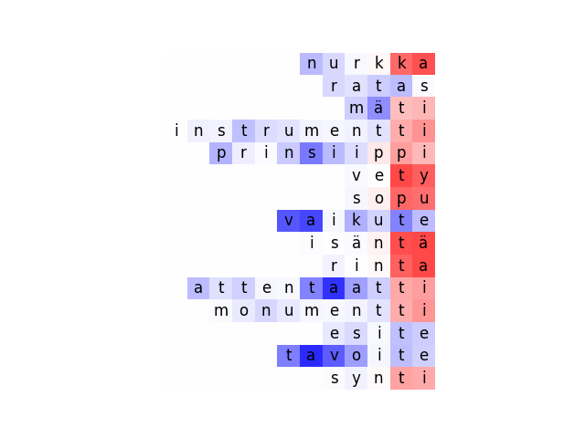 |  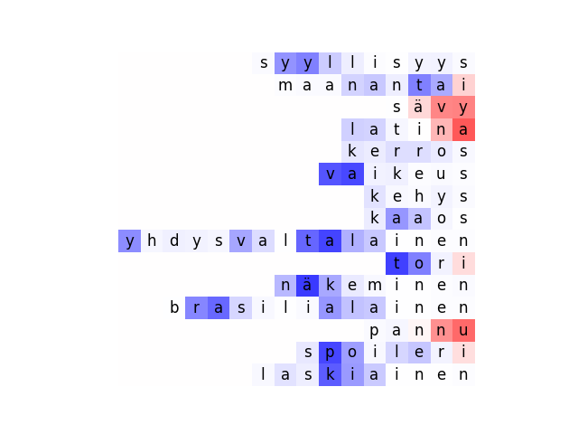

k            | p            | t
:-------------------------:|:-------------------------:|:-------------------------:
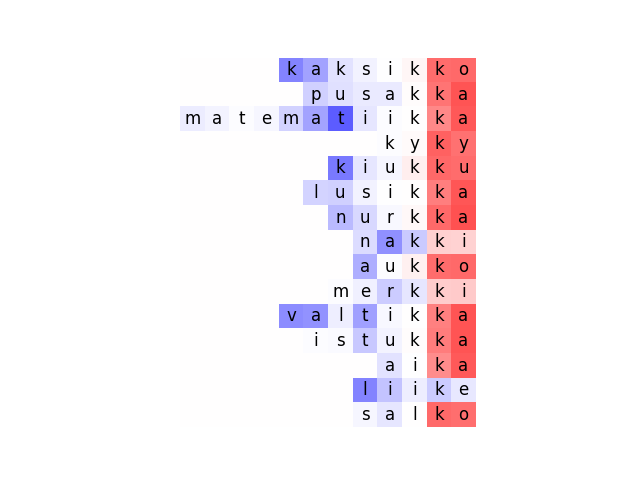 |  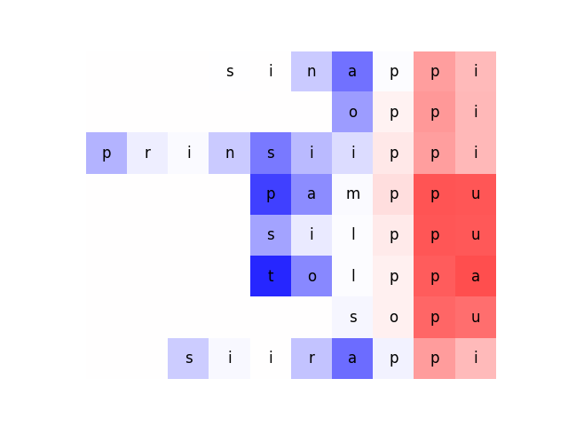 | 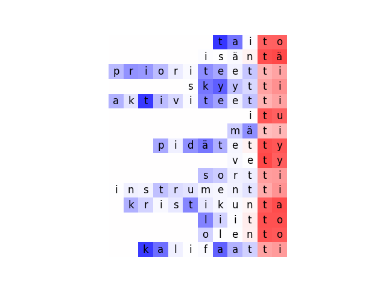

### 466 (among top-20 active states for k, p and t gradation)

Maybe this one always fires a bit at the end of the string but it's clearly stronger when gradation is present.

Gradation            | No gradation
:-------------------------:|:-------------------------:
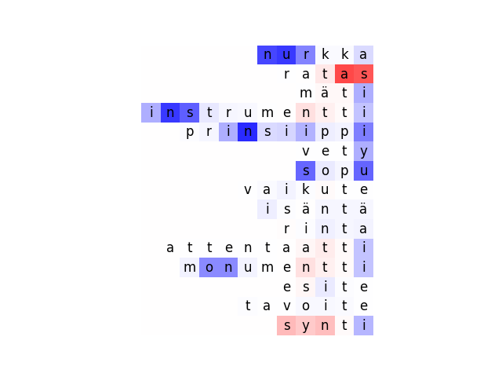 |  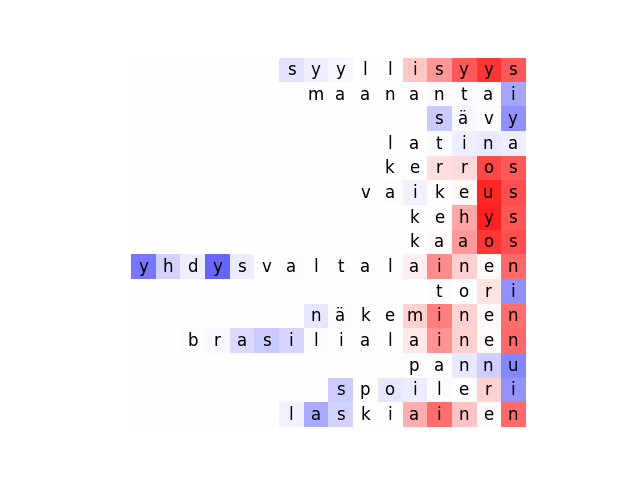

k            | p            | t
:-------------------------:|:-------------------------:|:-------------------------:
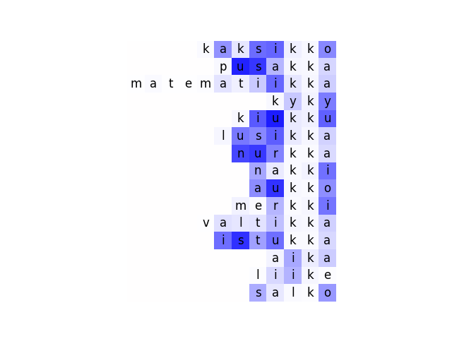 |  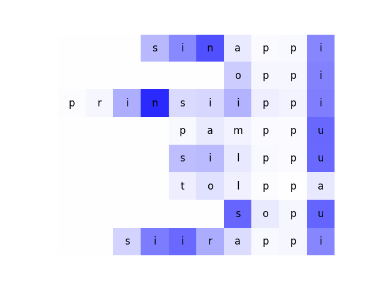 | 

### 197 (highest activation for p gradation)

Seems to be active specifically for those p which undergo gradation as seen by examining "prinsiippi" where the activation for the first and second p differ markedly.  Some activity for k and t.

Gradation            | No gradation
:-------------------------:|:-------------------------:
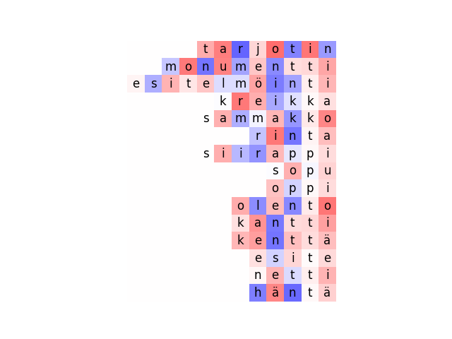 |  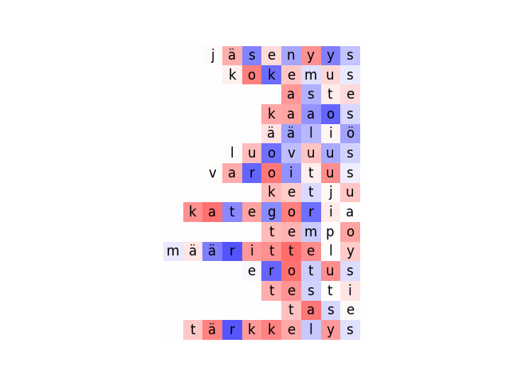

k            | p            | t
:-------------------------:|:-------------------------:|:-------------------------:
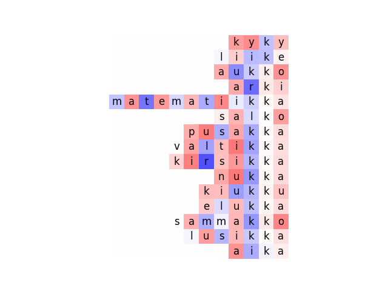 |  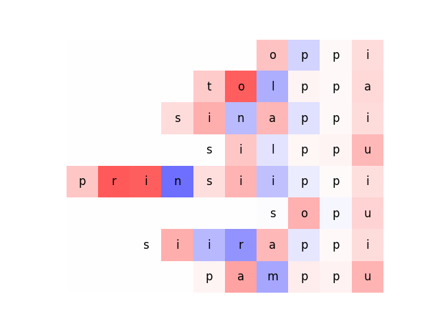 | 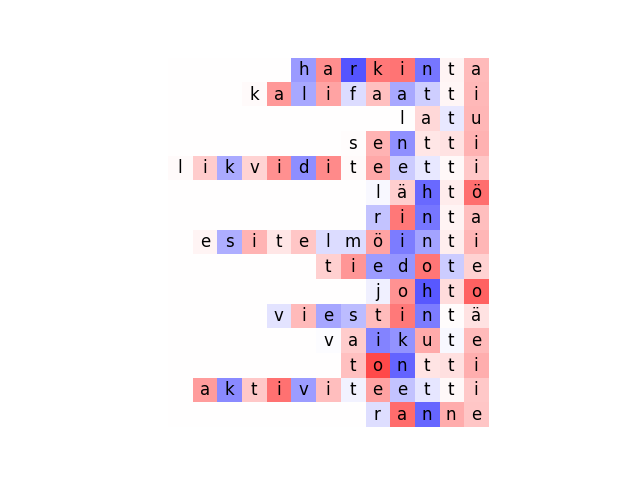

### 207 (among top-20 active states for k, p and t gradation)
Gradation            | No gradation
:-------------------------:|:-------------------------:
 |  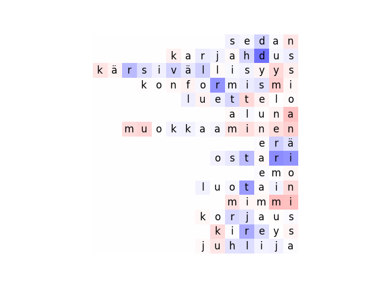

k            | p            | t
:-------------------------:|:-------------------------:|:-------------------------:
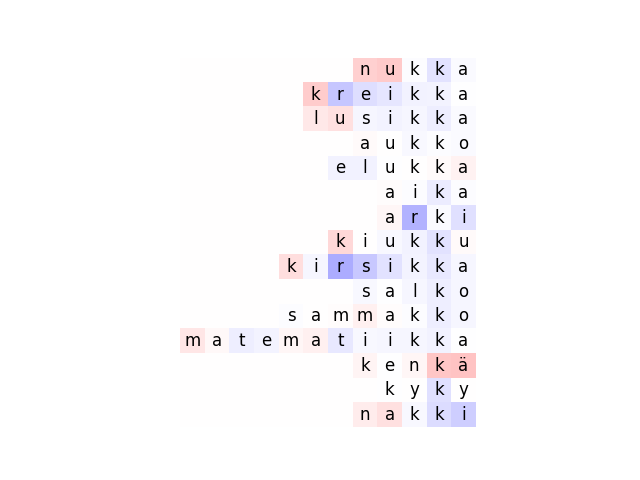 |  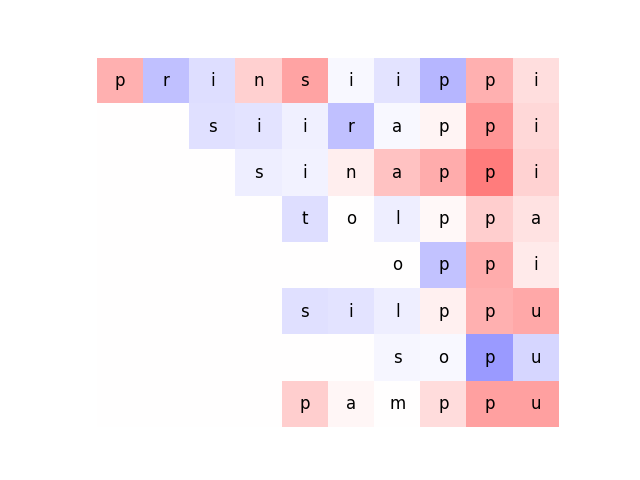 | 

### 402 (highest activation for k gradation)

This one just seems to associate with k regardless of where it occurs.

Gradation            | No gradation
:-------------------------:|:-------------------------:
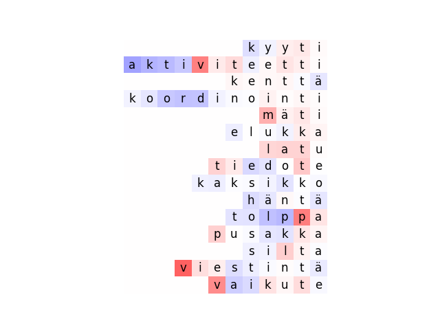 |  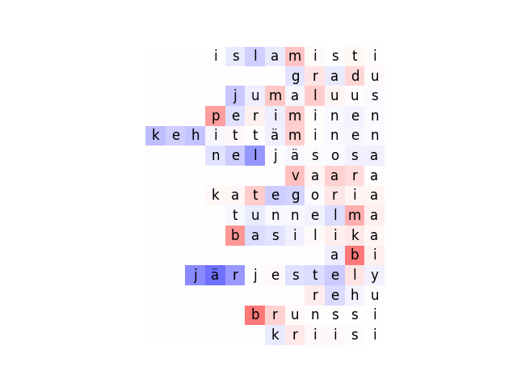

k            | p            | t
:-------------------------:|:-------------------------:|:-------------------------:
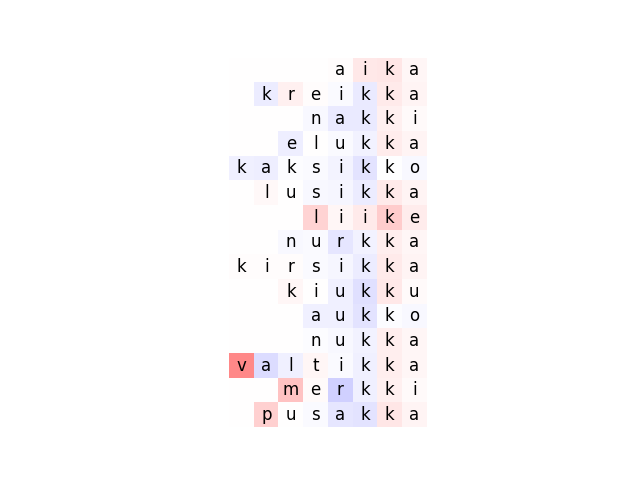 |  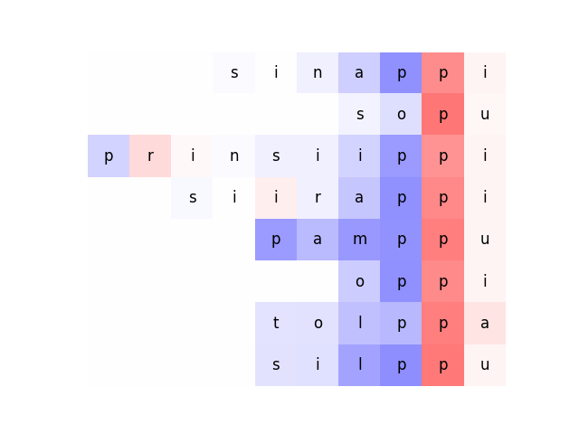 | 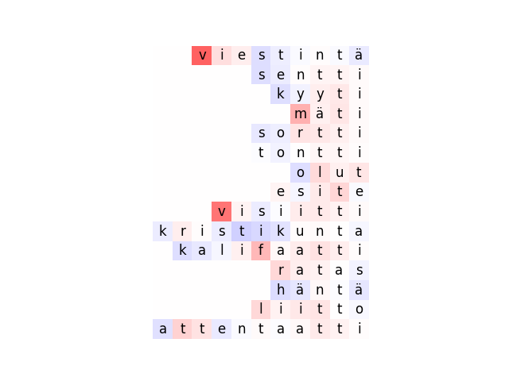

### 297 (highest activation for k gradation)

This one just seems to associate with k regardless of where it occurs.

Gradation            | No gradation
:-------------------------:|:-------------------------:
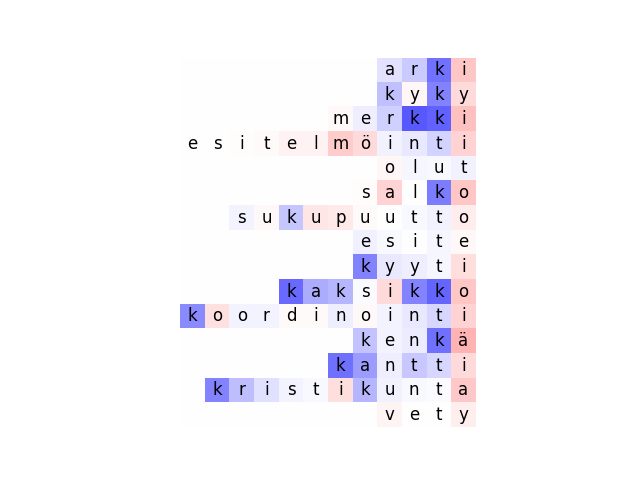 |  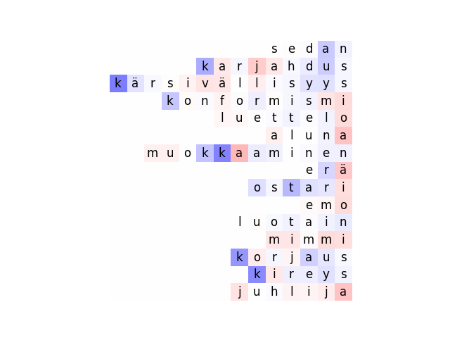

k            | p            | t
:-------------------------:|:-------------------------:|:-------------------------:
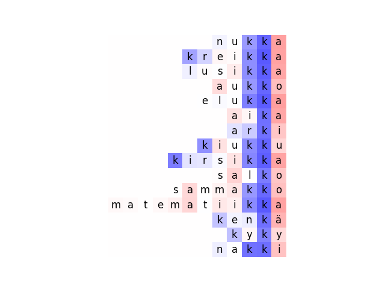 |  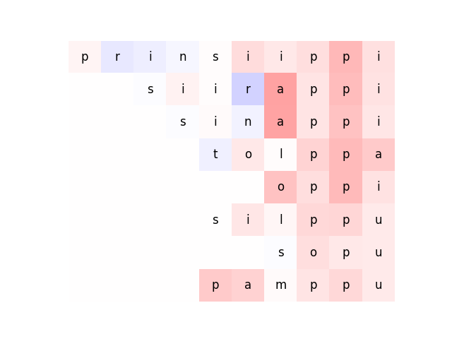 | 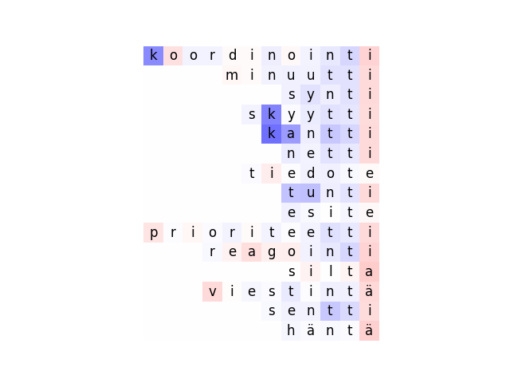

