## Running scripts

To run inference on the model (outputs files pred.txt and foo_step_3000.pt.treebank-nouns.tsv.nom2gen.valid.src.enc_states.pkl):

python3 ../OpenNMT-py/translate.py --src treebank-nouns.tsv.nom2gen.valid.src --model foo_step_3000.pt --batch_size 1

To find states which fire strongly when the stem undergoes gradation for k, p or t, run:

python3 analyse_hidden_states.py

To track the activation of the a hidden state in different positions the input strings, run:

python3 find_state_max.py

To draw heatmaps:

python3 plot_activation_heat_map.py

## Heatmaps for various states

### 256 (highest activation for t gradation, also high activation for k and t)
Gradation            | No gradation
:-------------------------:|:-------------------------:
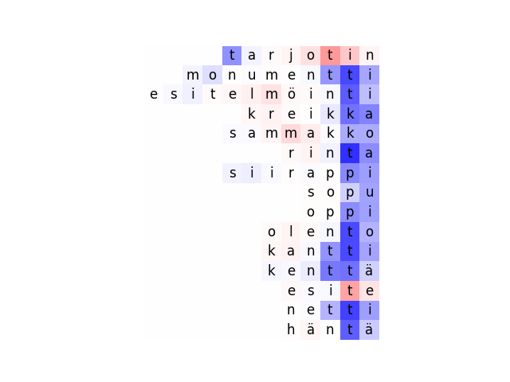 |  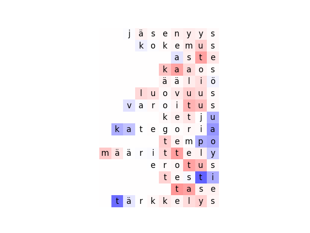

k            | p            | t
:-------------------------:|:-------------------------:|:-------------------------:
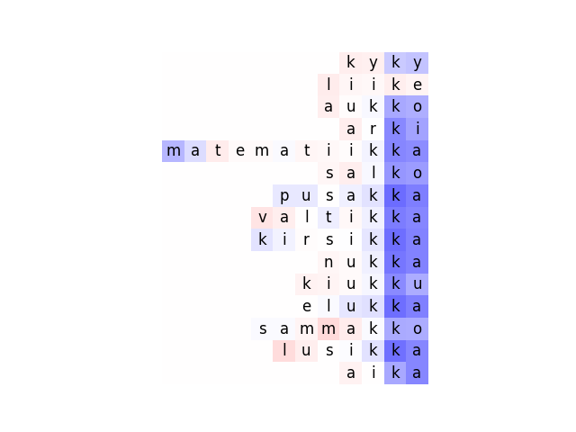 |  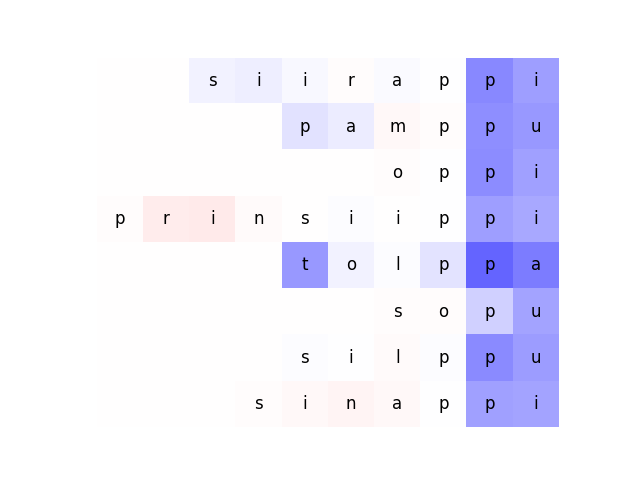 | 

### 349 (among top-20 active states for k, p and t gradation)
Gradation            | No gradation
:-------------------------:|:-------------------------:
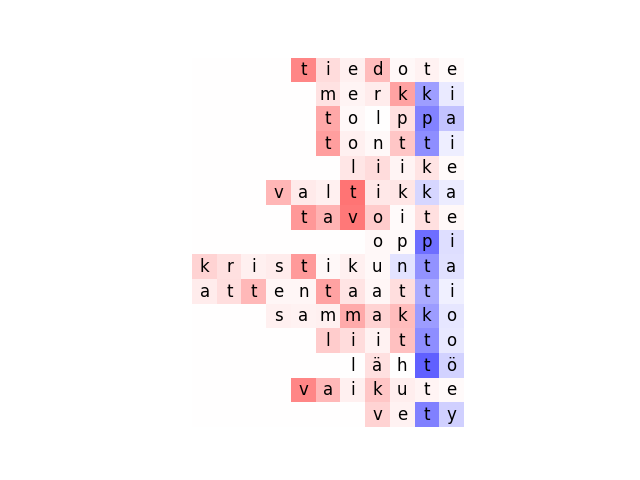 |  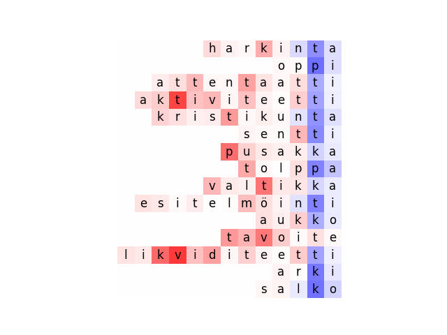

k            | p            | t
:-------------------------:|:-------------------------:|:-------------------------:
 |  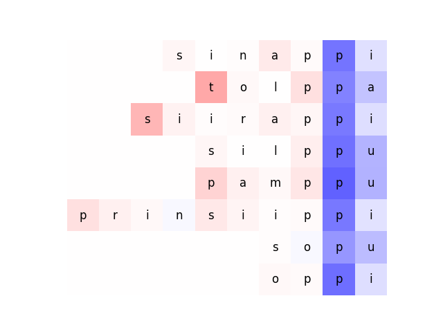 | 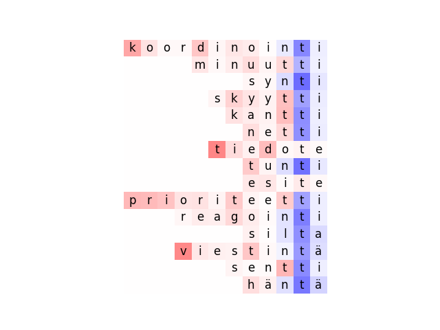

### 410 (highest activation for p gradation)
Gradation            | No gradation
:-------------------------:|:-------------------------:
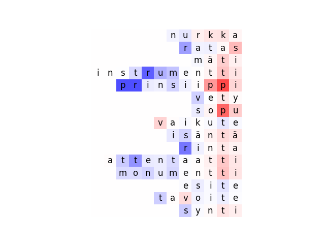 |  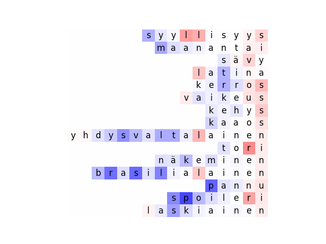

k            | p            | t
:-------------------------:|:-------------------------:|:-------------------------:
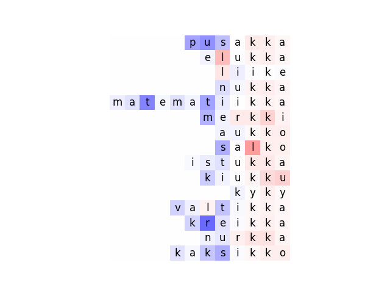 |  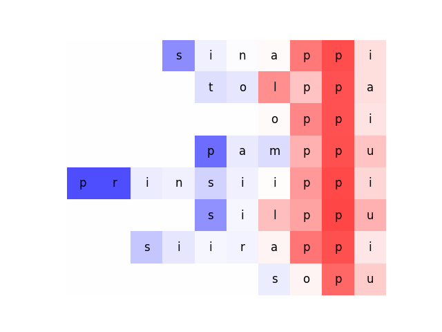 | 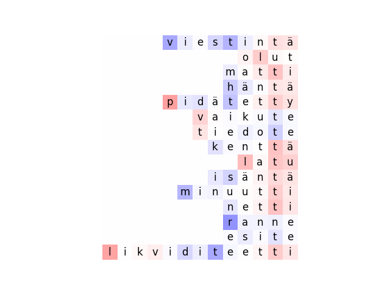

### 446 (among top-20 active states for k, p and t gradation)
Gradation            | No gradation
:-------------------------:|:-------------------------:
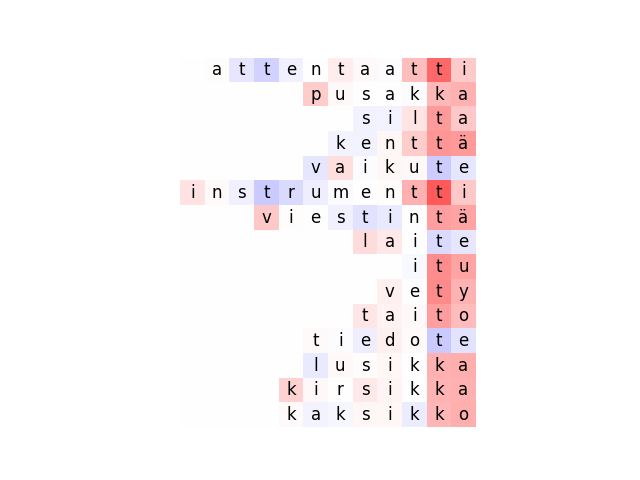 |  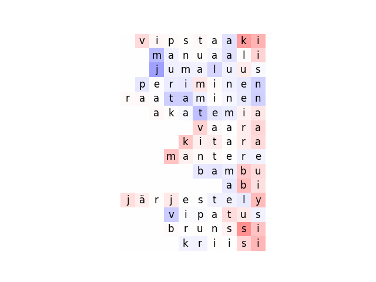

k            | p            | t
:-------------------------:|:-------------------------:|:-------------------------:
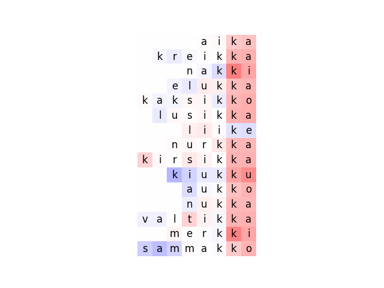 |  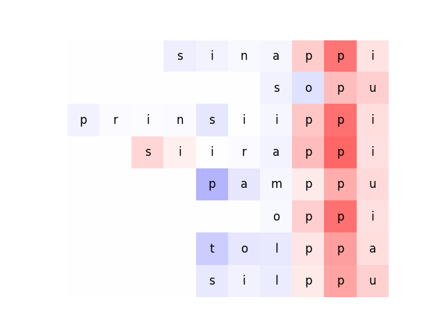 | 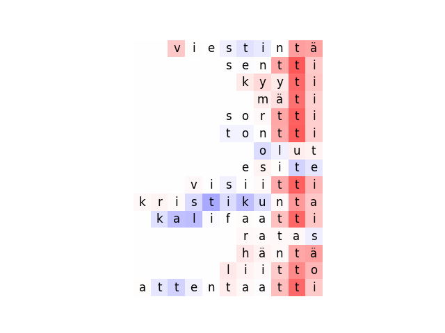

### 476 (highest activation for k gradation)
Gradation            | No gradation
:-------------------------:|:-------------------------:
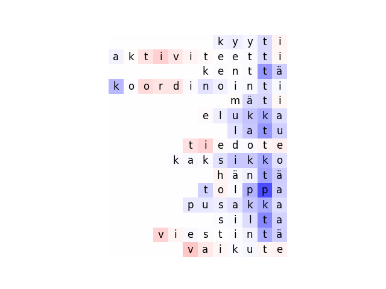 |  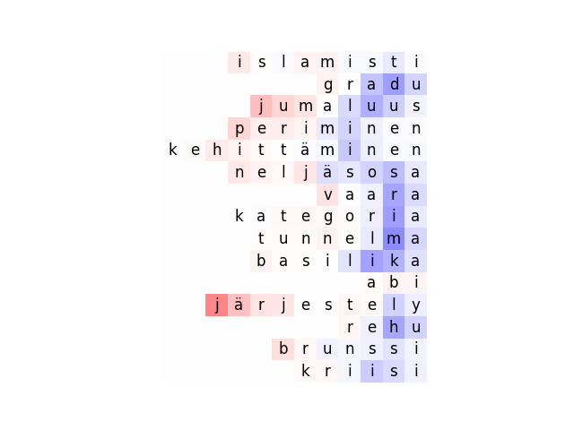

k            | p            | t
:-------------------------:|:-------------------------:|:-------------------------:
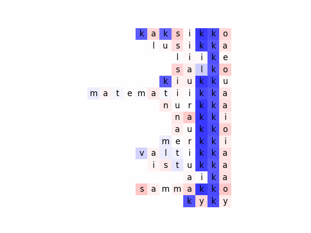 |   | 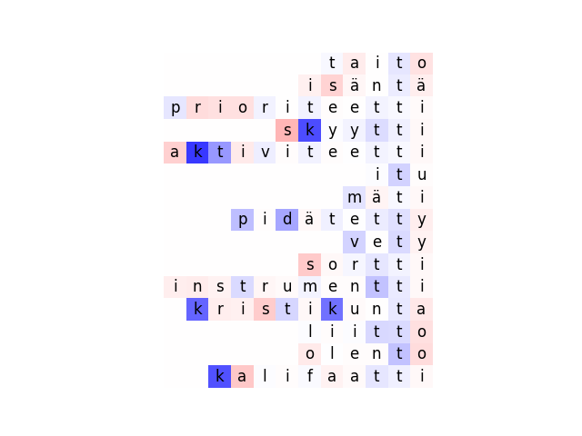
