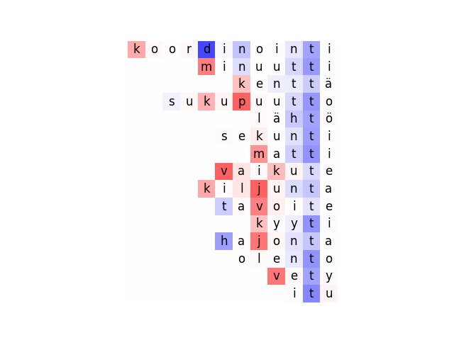

## Running scripts

### `translate.py`

We use a custom version of OpenNMT-py which is included in the repo. If you're only interested in translation, you can use the command:

```python3 ../OpenNMT-py/translate.py --src input_file.txt --model model.pt```

If you want to store encoder representations, this can be accomplished using the flag `--repr_file` which allows you to give a pkl file as argument where encoder representation will be stored.

```python3 ../OpenNMT-py/translate.py --src input_file.txt --model model.pt --repr_file representations.pkl --batch_size 1```

**Note** that you should always set `--batch_size 1` when storing representations. This is required because OpenNMT internally permutes the examples in a batch of size > 1.

You can also scale encoder state activations in a **limited** way using the `--perturb_states` and `--scaling_factor` flags. For example:

```python3 ../OpenNMT-py/translate.py --src input_file.txt --model model.pt --perturb_states 1,2,3,4 --scaling_factor -1```

The code will scale the activations of the encoder states 1 - 4 at the penultimate position in the input string. This is the position where gradation typically occurs. 

**Note** that you should always set `--batch_size 1` when using scaling state activations. This is required because it is difficult to identify the penultimate position in a batch of size > 1 where examples don't necessarily have equal lengths.

### `evaluate.py`

```python3 compare.py --sys sys_file.txt  --gold data/treebank-nouns.tsv.nom2gen.valid.tgt```

Output:
```
Correct forms: 532, Total forms: 564, Accuracy for all forms: 94.33
```

```python3 compare.py --sys sys_file.txt  --gold data/treebank-nouns.tsv.nom2gen.valid.tgt --annotated data/treebank-nouns.tsv.nom2gen.valid.annotated.csv```

Output:
```
Correct forms: 532, Total forms: 564, Accuracy for all forms: 94.33
Correct forms: 153, Total forms: 162, Accuracy for all grad forms: 94.44
Correct forms: 379, Total forms: 401, Accuracy for all non-grad forms: 94.51
```

### `analyse_hidden_states.py`

To find states which fire strongly when gradation occurs, use the `analyse_hidden_states.py` script:

```python3 analyse_hidden_states.py --representation representations.pkl --top_N 5```

which will print the top-N list of states which correlate with gradation and a table of activation deltas:

```
TOP 5 states firing when gradation occurs:
487,207,203,484,221

\begin{adjustbox}{width=0.32\textwidth}
\begin{tabular}{lccccc}
\multicolumn{6}{c}{{\sc Model --representation}}\\
\toprule
\multirow{2}{*}{\textbf{Gradation}} & \multicolumn{5}{c}{\textbf{State}}\\
 & 487 & 207 & 203 & 484 & 221\\
\midrule
K & 0.205 &{\bf0.412} &{\bf0.393} &{\bf0.263} &{\bf0.276} \\
P & {\bf0.717} &{\bf0.471} &{\bf0.248} &{\bf0.622} &{\bf0.366} \\
T & {\bf0.567} &0.080 &{\bf0.324} &{\bf0.475} &0.127 \\
Qual. & {\bf0.684} &{\bf0.254} &{\bf0.268} &0.118 &{\bf0.249} \\
Quant. & {\bf0.440} &{\bf0.423} &{\bf0.323} &{\bf0.358} &{\bf0.289} \\
\bottomrule
\end{tabular}
\end{adjustbox}
```

## Additional experiments to run

### Activation scaling experiments

We run activation scaling experiments as a direct test of the influence of a particular hidden state on gradation. So far, we've extracted the top-20 states associated with gradation from model 3 and scaled those by factors -6, -5, ..., -1, 0 and 1. We applied the model on the set of all forms undergoing gradation from the dev data `data/gradating_src.txt` then computed accuracy w.r.t. two "gold standard" files `data/gradating_src.txt` and `data/non_gradating_trg.txt`. The first file contains the correct gold standard output forms like _laukun_ for the nominative _laukku_ which have undergone gradation. The second file contains forms like _laukkun_ which are correct apart from the fact that gradation did not apply.

We would still need to:
1. Run scaling experiments using 1, 5, 10, and 15 top-states in addition to 20.
1. Run experiment on other models than 3.

### Hidden dimension

Currently, all of our models have encoder hidden dimension 250. Given that they are bidirectional models, this means that we get 500 hidden neurons in total. We should run the significance experiments using models of lower dimensionality 10, 50, 100, 150, 200. Additionally, we sould train both 1-layer and 2-layer models. Currently, all of our models are 2-layer. 

### Correlating states

Are there instances where a small number states jointly code for gradation? We might want to use [a decomposable probe](https://arxiv.org/pdf/2010.02812.pdf)

## Heatmaps for various states (produced by `plot_activation_heat_map.py`)

### Model 3, State 487 (highest overall activation for gradation for k, p and t)


Gradation            | No gradation
:-------------------------:|:-------------------------:
 |  

k            | p            | t
:-------------------------:|:-------------------------:|:-------------------------:
 |   | 

Qualitative            | Quantitative  
:-------------------------:|:-------------------------:
 |   

### Model 3, 484 (among top-5 active states for k, p and t gradation)

Gradation            | No gradation
:-------------------------:|:-------------------------:
 |  

k            | p            | t
:-------------------------:|:-------------------------:|:-------------------------:
 |   | 

Qualitative            | Quantitative  
:-------------------------:|:-------------------------:
 |   
