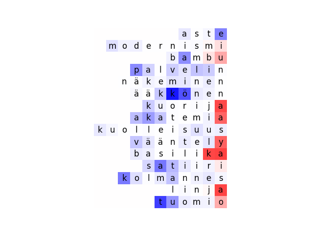
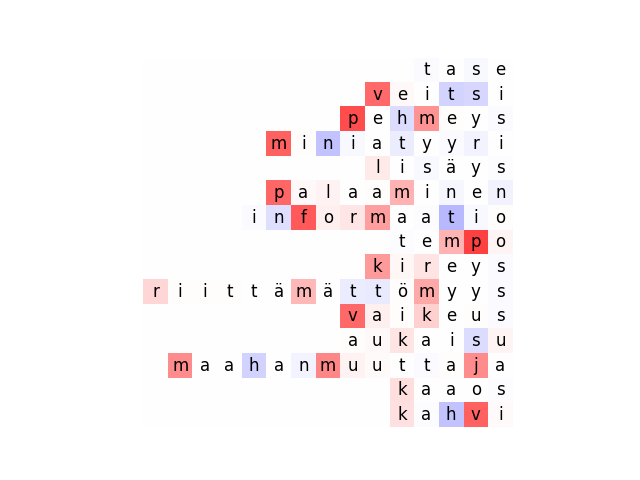

## Running scripts

To run inference on the model (outputs files pred.txt and foo_step_3000.pt.treebank-nouns.tsv.nom2gen.valid.src.enc_states.pkl):

python3 ../OpenNMT-py/translate.py --src treebank-nouns.tsv.nom2gen.valid.src --model foo_step_3000.pt --batch_size 1

To find states which fire strongly when the stem undergoes gradation for k, p or t, run:

python3 analyse_hidden_states.py

To track the activation of the a hidden state in different positions the input strings, run:

python3 find_state_max.py

To draw heatmaps:

python3 plot_activation_heat_map.py

## Heatmaps for various states

### Model 3, State 487 (highest overall activation for gradation for k, p and t)

Gradation            | No gradation
:-------------------------:|:-------------------------:
 |  

k            | p            | t
:-------------------------:|:-------------------------:|:-------------------------:
 |   | 

Qualitative            | Quantitative  
:-------------------------:|:-------------------------:
 |   

### Model 3, 484 (among top-5 active states for k, p and t gradation)

Gradation            | No gradation
:-------------------------:|:-------------------------:
 |  

k            | p            | t
:-------------------------:|:-------------------------:|:-------------------------:
 |   | 

Qualitative            | Quantitative  
:-------------------------:|:-------------------------:
 |   
